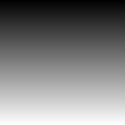

# Yeni Başlayanlar için PYTHON ile OpenCV
Merhaba arkadaşlar. Bu sayfada **OpenCV**'nin **OpenCV for Beginners** isimli resmi kursunu takip ediyor olacağız. Bu kursa 

https://opencv.org/course-opencv-for-beginners/

bağlantısından ulaşabilirsiniz. Kursa kayıt ücreti $117. Ben bu kursa  

https://www.kickstarter.com/projects/opencv/opencv-for-beginners

bağlantısından çok önce kayıt olup $57 ödemiştim. Sizin bu kursa kaydolmanız zorunlu değil.

Buradaki projelerimizde **Python 3.9.6** ve **OpenCV 4.5.3** kullanıyoruz. Aşağıda açıklamalarını/sonuçlarını gördüğünüz projelerin **py** ve **ipynb** uzantılı (bazen MATLAB ve C++ kodlarını da koyabiliriz ki MATLAB kodlarının uzantısı **m** iken C++ kodlarının uzantısı **cpp** olarak görünecektir) kodları yukarıda **project** isimli dosyada bulabilirsiniz. Bilgisayarınıza Python yüklemek için aşağıdaki resime tıkladığınızda açılan videoyu takip edebilirsiniz.

[](https://youtu.be/QmLXzB3N5pM)

Bilgisayarınıza OpenCV yüklemek için de aşağıdaki resimlere tıklandığında görüntülenen videoları sırasıyla izleyebilirsiniz.

[](https://youtu.be/aavhf3C9SlE)
[](https://youtu.be/-OiJgg3pnYI)

Bilgisayarlarınıza **Python** ve **OpenCV** kurduktan sonra **Jupyter Notebook**'un içine sanal ortamımız (virtual environment - venv) olan **opencv-env** ismini kayıt etmek (register) için aşağıdaki resme tıklayınca açılan videoyu izleyin. Bu videoda ayrıca **Jupyter Notebook** kullanarak bir **ipynb** kodunu da bilgisayarımızda koşturmuş olacağız. Dosyanın uzantısının açık hali **interactive python notebook**, kısa haliyle **ipynb**.

[](https://youtu.be/6wFsCuEj5JY)
## Proje 1: Resim Yükleme, Resmin Üzerine Yazı Yazma, Resmi Yeniden Boyutlandırma ve Kaydetme
Bu egzersizde OpenCV kütüphanesinden **imread()**, **putText()**, **resize()** ve **imwrite()** fonksiyonlarını kullanacağız. Resim yüklemek için kullandığımız fonksiyon olan **imread()** argüman olarak uzantısıyla beraber resim/fotoğraf ismi kabul ediyor. Yani fonksiyona *string* veri tipinde resmin uzantılı ismini giriş olarak veriyoruz. Mesela burada fotoğrafımızın ismi **IMG_20210616_202539.jpg** olduğundan **imread('IMG_20210616_202539.jpg')** şeklinde fonksiyonu çağırdığımızda resmi bizim ismini verdiğimiz değişkene yüklüyor. Bu arada gözden kaçırmayın, bütün fonksiyonları her zaman **cv2** anahtar kelimemizin sonuna **nokta** koyup çağırıyoruz, çünkü **cv2** kodda OpenCV kütüphanesini temsil ediyor. Zaten bu yüzden her kodumuzun başında **import cv2** diye bir komutla OpenCV'yi aktif hale getirmiş oluyoruz. Burada yazdıklarımızın kısa bir özeti: Eğer **IMG_20210616_202539.jpg** isimli bir resmi OpenCV'de Python ile okuyup **resim** isminde bir değişkene atamak istiyorsak, o zaman aşağıdaki kodu koşturmalıyız.

```
import cv2
resim = cv2.imread('IMG_20210616_202539.jpg')
```

ve burada **type(resim)** komutu ile yüklediğimiz resmin tipine bakacak olursak **numpy.ndarray** tipinde bir veri görüyoruz ki bu da bize OpenCV'nin resimleri hafızada tutmak/erişmek için **numpy** kütüphanesi kullandığını gösteriyor. Aşağıda dördüncü egzersizde **numpy** kütüphanesi kullanarak kendimiz gri tonun bütün piksel şiddet değerlerini tarayan sentetik bir resim oluşturacağız. Bu yüzden **numpy** kütüphanesini neden kullandığımız ve de **numpy.ndarray** yani uzun haliyle **n dimedional array** ne manaya geliyor, bunlar bizim için çok olmasa da biraz önemli. 

Yüklediğimiz resmin **features** denilen özelliklerine bakmak istediğimizde konsola

```
dir(resim)
```

komutunu yazarız. Karşımıza çıkan özelliklerden birisi de **shape** yani resmin şekli (bu bizim **çok sık** kullanacağımız bir özellik). Aşağıdaki kod resmin yüksekliğini (satır sayısı - height), genişliğini (sütun sayısı - width) ve BGR (Blue-Green-Red yani Mavi-Yeşil-Kırmızı) kanal sayısını (channels) **print** komutuyla ekrana basıyor.

```
print('yükseklik = %i   genişlik = %i   kanal sayısı = %i' %(resim.shape[0], resim.shape[1], resim.shape[2]))
```

Aşağıdaki videoyu izleyerek yukarıda anlatılan kodu **Jupyter Notebook**'da gerçekleyebilirsiniz.
[](https://youtu.be/2bLhk2sV_jk)

```
import cv2 # OpenCV kütüphanesine erişim
resim = cv2.imread('IMG_20210616_202539.jpg') # resim yükle
print('yükseklik = %i   genişlik = %i   kanal sayısı = %i' %(resim.shape[0],resim.shape[1],resim.shape[2]))
# resmin üzerine yazı yazalım
font = cv2.FONT_HERSHEY_SIMPLEX # font tipi
org = (300, 300) # yazının içinde bulunduğu dikdörtgenin sol alt köşesi
fontScale = 7 # font büyüklüğü
color = (0, 0, 0) # BGR sırasında yazının renk kodu
thickness = 12 # yazının kalınlığı
yaziliResim = cv2.putText(resim, 'Gumushane', org, font, fontScale, color, thickness, cv2.LINE_AA)
# resmi yeniden boyutlandır, dosyaya kaydet ve ekranda görüntüle
s = 0.2 # scale - ölçek
dim = (int(s*resim.shape[1]), int(s*resim.shape[0])) # boyut
yeniYaziliResim = cv2.resize(yaziliResim, dim, interpolation = cv2.INTER_AREA)
cv2.imwrite('Gumushane.jpg', yeniYaziliResim, [cv2.IMWRITE_JPEG_QUALITY, 100])
cv2.imshow("Uzerine yazi yazilmis ve yeniden boyutlandirilmis resim", yeniYaziliResim)
cv2.waitKey(0) # klavyede herhangi bir tuşa basana kadar ekranda görüntüle
```

## Proje 2: Web Kamerasına Erişim, Renkli Resmin Gri Tonlu ve Siyah-Beyaz (Binary) Hale Dönüşümü ve Görüntüye Filtre Uygulanması
Video dediğimiz şey ard arda yakalanan (capture) resimlerin ekranda seri halde görüntülenmesinden başka birşey değil. Burada **FPS** kavramı karşımıza çıkıyor. Yani **Frame per Second**, Türkçesi saniyedeki kare sayısı. Genelde bu değer standart web kameraları için 30. OpenCV kullanarak bilgisayarımızın web kamerasını aşağıdaki komutla açabiliriz.

```
cap = cv2.VideoCapture(0)
```

Burada **VideoCapture()** web kamerasına erişmek için yazılmış sınıf (class) ismi - bizim için bir komut. Bu komuta 0 girişini verdik çünkü bilgisayarımızda eğer bir web kamerası varsa o kameraya 0 atanmış. Eğer birden fazla kamera varsa, o zaman argüman olarak 0 değil de 1, 2, ... girebiliriz. Bu arada **VideoCapture** komutunun (aynı zamanda OpenCV kütüphanesinde **videoio** ana modülünde bir sınıf) bize döndürdüğü değişkene biz **cap** dedik. Burada **capture** kelimesinin kısaltması olan **cap** ismini uygun bulduk zira **capture** demek yakalamak demek ki web kamerası da saniyede otuz kez görüntüyü yakalayarak bize video sağlamış oluyor. OpenCV'de **VideoCapture** sınıfı bize web kamerası başarıyla açıldı mı açılmadı mı kontrol etmemiz için bir fonksiyon kullanımımıza sunuyor: **isOpened()**. Yukarıda **VideoCapture()** komutunun bize döndürdüğü **cap** değişkeni üzerinden aşağıdaki gibi kontrol edelim.

```
if (cap.isOpened() == False):
    print('Web kamerasına erişimde sorun yaşandı!')
else:
    print('Kameranın FPS değeri %i.' %cap.get(cv2.CAP_PROP_FPS))
```

Eğer kamera yoksa veya erişimde (veya bağlantıda) bir sıkıntı yaşandıysa o zaman ekrana **Web kamerasına erişimde sorun yaşandı!** yazılacak. Aksi durumda kameradan **kare**ler (İng. **frame**) sürekli geliyor olacak ve web kamerasının **FPS** değerini ekrana basacağız. Kameraya başarıyla eriştiğimizi kabul ederek devam ediyoruz. Şimdi görüntü sürekli gelmeye devam edeceğinden, web kamerası görüntü verdiği müddetçe aktif olacak bir döngü oluşturup, bu döngü içine her girişte web kamerasından resmi alıp **frame** isimli bir değişkene atayalım ve ardından döngüden çıkmadan bu yakalanan renkli resmi sırasıyla ilk önce gri tonlu tek kanallı bir resme (**gray** isminde bir değişkene), sonra **eşikleme** (İng. **threholding**) ile **binary** yani siyah-beyaz bir resme (**bw** isminde bir değişkene) çevirelim [3].

```
while (cap.isOpened() == True):
    ret, frame = cap.read()
    s = 0.75 # ölçek (scale)
    dim = (int(s*frame.shape[1]), int(s*frame.shape[0]))
    frame = cv2.resize(frame, dim, interpolation = cv2.INTER_AREA)
    gray = cv2.cvtColor(frame, cv2.COLOR_BGR2GRAY)
    (T, bw) = cv2.threshold(gray, 75, 255, cv2.THRESH_BINARY)
    if ret == True:
        cv2.imshow('renkli resim', frame)
        cv2.imshow('gri tonlu resim', gray)
        cv2.imshow('siyah beyaz resim', bw)
        if cv2.waitKey(1) & 0xFF == ord('q'):
            cv2.imwrite('renkli resim.jpg', frame, [cv2.IMWRITE_JPEG_QUALITY, 100])
            cv2.imwrite('gri tonlu resim.jpg', gray, [cv2.IMWRITE_JPEG_QUALITY, 100])
            cv2.imwrite('siyaz beyaz resim.jpg', bw, [cv2.IMWRITE_JPEG_QUALITY, 100])
            break
    else:
        print('Kare yakalanamadı!')
        break
cap.release()
cv2.destroyAllWindows()
```

Buraya kadar olan kodu **web_cam_stream_bgr_gray_bw.py** ismiyle yukarda projeler kısmında ilgili projede bulabilirsiniz. Bu kodun açıklaması için aşağıdaki resime tıklayıp videoyu izleyebilirsiniz.

[](https://youtu.be/kSCDLw6Aa3E)
### OpenCV fonksiyonlarının hız bakımından "optimal" olması
Yukarıda OpenCV'nin **threshold** fonksiyonunu kullanarak gri tonlu hale getirdiğimiz **gray** isimli görüntüyü siyah beyaz hale (**bw** isminde) getirmiştik. OpenCV görüntüyü hangi veri tipi olarak bilgisayarın hafızasında tutuyor, piksellerin şiddet değerleri nedir ve bu değerlere nasıl erişilir gibi konuları anlamak ve de kendi yazdığımız bir fonksiyonu OpenCV'nin aynı işi yapan bir fonksiyonu ile hız (optimallik) açısından kıyaslamak için kendimiz **threshold()** isminde bir fonksiyon yazdık. Bu fonksiyonu **cv2.threshold()** diye değil de direk olarak **threshold()** şeklinde çağıracağız.

```
def threshold(img, T):
    bwUser = np.zeros_like(img)
    for i in range(img.shape[0]):
        for j in range(img.shape[1]):
            if (img[i][j] > T):
                bwUser[i][j] = 255
    return bwUser
```

Yukarıda gri tonlu görüntüyle aynı boyutta (satır ve sütun sayısı aynı olan) yeni bir resim (bütün piksel değerleri sıfır olan) oluşturabilmek için **numpy** kütüphanesinden **zeros_like()** komutunu çağırmamız gerekti. Bu yüzden de kodumuzun başına

```
import numpy as np
```

satırını ekledik. Daha önceden OpenCV yükleme videolarında sanal ortamımız **opencv-env**'a **numpy** yüklemiş olduğumuzdan bu pakete bir satırla sorunsuz erişebildik. Yoksa sanal odaya ayrıca yüklememiz gerekecekti. Bu değişikliklerin ardından ana döngümüzde ilgili yeri şöyle güncelledik.

```
# (T, bw) = cv2.threshold(gray, 150, 255, cv2.THRESH_BINARY)
bw = threshold(gray, 60)
```

Sonrasında kodu koşturduğumuzda ekranda duraklamalar gördük. Bu yavaşlamanın sebebi bizim yazdığımız **threshold()** fonksiyonun OpenCV'nin kendi built-in **threshold()** fonksiyonu kadar hızlı çalış(a)mamasıdır. İlgili kodun ismi **web_cam_stream_bgr_gray_user_bw.py**. Videoyu izlemek için aşağıdaki resme tıklayınız.

[](https://youtu.be/euN1WgKzFiY)

### Gürültüyü gidermek için görüntüye filtre uygulanması
Yukarıda siyah-beyaz resme baktığımızda bazı piksellerin siyah ile beyaz arasında değiştiğini (titreme gibi) görmüştük. Gürültüyü yok etmek için resmi biraz bulandırabiliriz [4]. Bunun için de OpenCV kütüphanesinin **imgproc** isimli ana modülünden **blur()** ve **GaussianBlur()** fonksiyonlarını kullanacağız. Bu modüle bakmışken **medianBlur()** fonksiyonuyla medyan filtresine de bakalım. Ayrıca snapshot gibi bazı uygulamalarda kullanılan özel bir Gaussian bulanıklaştırma filtresi olan **bilateralFilter()** komutuna da bakacağız.

```
import cv2
cap = cv2.VideoCapture(0)
if (not cap.isOpened()):
    print('Web kamerasına erişimde sorun yaşandı!')
else:
    print('Kameranın FPS değeri %i.' %cap.get(cv2.CAP_PROP_FPS))

while (cap.isOpened() == True):
    ret, frame = cap.read()
    s = 0.75 # ölçek (scale)
    dim = (int(s*frame.shape[1]), int(s*frame.shape[0]))
    frame = cv2.resize(frame, dim, interpolation = cv2.INTER_AREA)
    filtered = cv2.blur(frame, (7, 7))
    # filtered = cv2.GaussianBlur(frame, (17, 17), 0)
    # filtered = cv2.medianBlur(frame, 11)
    # filtered = cv2.bilateralFilter(frame, 11, 69, 39)
    gray = cv2.cvtColor(filtered, cv2.COLOR_BGR2GRAY)
    (T, bw) = cv2.threshold(gray, 70, 255, cv2.THRESH_BINARY)
    if ret == True:
        cv2.imshow('renkli resim', frame)
        cv2.imshow('filtrelenmis resim', filtered)
        cv2.imshow('gri tonlu resim', gray)
        cv2.imshow('siyah beyaz resim', bw)
        if cv2.waitKey(1) & 0xFF == ord('q'):
            cv2.imwrite('renkli.jpg', frame, [cv2.IMWRITE_JPEG_QUALITY, 100])
            cv2.imwrite('filtrelenmiş.jpg', filtered, [cv2.IMWRITE_JPEG_QUALITY, 100])
            cv2.imwrite('gri tonlu.jpg', gray, [cv2.IMWRITE_JPEG_QUALITY, 100])
            cv2.imwrite('siyah beyaz.jpg', bw, [cv2.IMWRITE_JPEG_QUALITY, 100])
            break
    else:
        print('Kare yakalanamadı!')
        break
        
cap.release()
cv2.destroyAllWindows()
```

Yukarıdaki kodun açıklamasını izlemek için aşağıdaki resme tıklayın. Adrian Rosebrock tarafından hazırlanmış ilgili tutorial'ı okumak için [4] nolu kaynağa bakınız.

[](https://youtu.be/Q0SO2F0b8Hg)
## Proje 3: Yüz Tespit Etme (Face Detection)
OpenCV'de **Haar cascade** metodu ile yüz tespiti yapacağız [5]. Adrian ayrıca **Haar Cascade** kullanarak yüz tespiti yaptığı bir projede işin içerisine iki tane servo motorda koyarak mekatronik bir proje yapmış [6]. İsteyenler OpenCV'nin **Haar Cascade** tutorial'ına da göz atabilirler [7]. Yazdığımız kodun tamamı aşağıda.

```
import cv2
# OpenCV tarafından hazır olarak bize sağlanan Haar Cascade yüz tanıma metodunu yükle
print("[BİLGİ] Haar cascade yüz tanıma metodunu yüklüyor...")
detector = cv2.CascadeClassifier('haarcascade_frontalface_default.xml')
cap = cv2.VideoCapture(1) # web kamerasına erişim
if (not cap.isOpened()):
    print('Web kamerasına erişimde sorun yaşandı!')
count = 0 # resimleri kaydederken isimlerini sırayla artan şekilde yapmak için kullanacağımız index
while (cap.isOpened() == True):
    ret, frame = cap.read() # web kamerasından görüntüyü al
    gray = cv2.cvtColor(frame, cv2.COLOR_BGR2GRAY) # renkli uzaydan gri tonlu uzaya geç
    # yakalanan kare üzerinde yüz tespiti yap. rects değişkeni tespit edilen yüzü içine alan dikdörtgenin 
    # sol üst (x, y) ve sağ alt (x+w, y+h) noktalarının koordinat bilgileri. Bu bilgiler yüzü dikdörtgen 
    # içine almamız için yeterli. Burada w harfi width yani yatay genişlik, h ise height yani yükseklik.
    rects = detector.detectMultiScale(gray, scaleFactor=1.05, minNeighbors=5, 
    minSize=(30, 30), flags=cv2.CASCADE_SCALE_IMAGE)
    # yüzü rectangle() komutuyla dikdörtgen içine al
    for (x, y, w, h) in rects:
        cv2.rectangle(frame, (x, y), (x + w, y + h), (0, 255, 0), 2)
    if ret == True:
        cv2.imshow('yuz tanima', frame)
        if cv2.waitKey(1) & 0xFF == ord('s'):
            imageName = 'face detection %i.jpg' %count
            cv2.imwrite(imageName, frame, [cv2.IMWRITE_JPEG_QUALITY, 100])
            print('Resim %s ismiyle kaydedildi.' %imageName)
            count = count + 1
        elif cv2.waitKey(1) & 0xFF == ord('q'):
            print('Güle güle!')
            break
        else:
            continue
    else:
        print('Kare yakalanamadı!')
        break
cap.release()
cv2.destroyAllWindows()
```

[](https://www.youtube.com/watch?v=twqV7TOBU3s)
## Proje 4: NUMPY Kütüphanesi Kullanarak Gri Uzayın Bütün Tonlarını Tarayan Sentetik Bir Resim Oluşturma
OpenCV'de **imread()** fonksiyonu ile *jpg* veya *png* formatında bir görüntü yüklediğimizde veya **cap = cv2.VideoCapture(0)** komutu ile web kamerasına erişip oradan kare (İng. frame) yakaladığımızda **imshow()** komutu ile monitörde **renkli** bir resim/video gördük. Bu renkli görüntünün **üç kanal**dan oluştuğunu, OpenCV'nin bu kanallara sırasıyla **B-G-R** dediğini ve açık halinin **Blue-Green-Red** yani **Mavi-Yeşil-Kırmızı** olduğunu söyledik. Her piksel üç ayrı kanal için 0-255 arası bir şiddet (İng. intensity) değerine sahip. Gri tonlu uzaya geçerken bu üç kanalın ağırlıklı ortalaması alınıyor ve tek kanala düşüyor. Yeni oluşan bu tek kanallı resime gri tonlu (İng. gray scale) resim dedik. Artık her bir piksel üç değil tek bir şiddet değerine sahip. Üç kanallı (renkli) resimdekine benzer bir mantıkla gri tonlu resimde de piksel şiddet değeri 0-255 arası bir değer alıyor. Burada **0** tam sayısı **siyah** renge, **255** de **beyaz** renge tekabül ederken ara değerler grinin tonlarını oluşturuyor. Mesela **127** değeri tam olarak **gri** renk. Yani %50 siyah - %50 beyaz karışımı olan gri. 

Bu egzersizde ilk önce **numpy** kütüphanesini aktif hale getirelim ve 256 sütuna sahip (satır sayısı değişken olabilir) bütün elemanları sıfır olan bir matris oluşturalım. Oluşturduğumuz matrisin veri tipi **uint8** olmalı çünkü gri tonlu bir görüntünün her bir pikseli bilgisayarın hafızasında **sekiz bit** yani **bir byte** yer kaplıyor. Aşağıda yazdığımız kodu görebilirsiniz. 

```
import cv2
import numpy as np
r, c = 256, 256 # satır ve sütun sayısı
resim = np.zeros((r, c), np.uint8) # r satır c sütundan oluşan elemanları sıfır olan bir matris
for i in range(resim.shape[0]): # satırları dolaşıyoruz
    for j in range(resim.shape[1]): # sütunları dolaşıyoruz
        resim[i][j] = j # i. satır j. sütundaki piksel değerini sütun numarası olan j yapalım
cv2.imshow('gri tonlu resim', resim)
cv2.imwrite('gri tonlu resim.jpg', resim, [cv2.IMWRITE_JPEG_QUALITY, 100])
cv2.waitKey(0)
```

Kodu koşturduğumuzda aşağıdaki sentetik görüntüyü elde ettik. Resmin ilk sütunundaki piksellerin şiddet değeri 0 olduğundan en sol taraf siyah renkle başlıyor. Sağa doğru gittikçe 0'dan 255'e kadar olan değerleri bir bir tarıyoruz. Böylece geçişlerle beyaz renge kadar gidiyoruz.


İlgili videoyu izlemek için aşağıdaki resime tıklayın.

[](https://youtu.be/eMBuYXLO4KI)
## ARA SINAV
Ara sınav sorularının çözümleri DBS'de dokuzuncu hafta bölümünde yapıldı. Videoları oradan izleyebilirsiniz. Ara sınavda kod içeren soruların çözümleri aşağıda. İlgili kodlar yukarıda **project/midterm** dizinine konuldu. İsteyenler kodları aşağıda da görebilir.
### Soru 5
Aşağıdaki kod ne yapmaktadır?

```
import cv2
picture = cv2.imread('abc.jpg')
print(picture.shape[0])
print(picture.shape[1])
picture = cv2.resize(picture, (int(picture.shape[1]/2), int(picture.shape[0]/2)),
interpolation = cv2.INTER_AREA)
cv2.imshow('resim', picture)
cv2.waitKey(0)
```

Bu kod ilk önce OpenCV'nin **imread()** fonksiyonu ile dosyada yer alan **abc.jpg** isimli resim dosyasını bilgisayarımızın RAM'ine okumaktadır. Yüklenen görüntüye *picture* isimli değişken ile erişebiliriz. Sonrasında **print()** komutlarıyla konsol ekranına ilk önce görüntünün piksel cinsinden yüksekliği (satır sayısı), ardından genişliği (sütun sayısı) basılıyor. Ardından gelen **resize()** komutuyla resmin eni ve boyu tam yarısına düşürülüyor. Son olarak da yeniden boyutlandırılmış resim **imshow()** komutuyla ekranda görüntüleniyor. Son satır olan **cv2.waitKey(0)** komutunda argümanın sıfır verilmesi kullanıcı tarafından bir tuşa basıldığında ekrandan görüntülenen resmin kapatılması manasına geliyor. Eğer **cv2.waitKey(2000)** deseydik görüntü ekranda 2000ms yani 2s kalıp otomatik olarak kapanacaktı. Bu şekilde otomatik olarak görüntüyü kapatma seri halinde resimleri ardarda görüntülemek istediğimiz zamanlarda oldukça kullanışlı olabilir.
### Soru 8
Aşağıdaki kodun çıktısı nedir?

```
import cv2
detector = cv2.CascadeClassifier('haarcascade_frontalface_default.xml')
resim = cv2.imread('messi ve ronaldo.jpg')
griResim = cv2.cvtColor(resim, cv2.COLOR_BGR2GRAY)
rects = detector.detectMultiScale(griResim, scaleFactor=1.25, minNeighbors=5, minSize=(30, 30), flags=cv2.CASCADE_SCALE_IMAGE)
k = 0 # tespit edilen yüz sayısı
isim = ['Ronaldo', 'Messi'] # oyuncuların isimlerini dikdörtgenin sol üst köşesinden x ekseninde kaydır
isimKaydirX = [85, 60]
for (x, y, w, h) in rects: # tespit edilen yüzleri dikdörtgen içine al ve oyuncunun ismini yazdır
    cv2.rectangle(resim, (x, y), (x + w, y + h), (255, 255, 255), 2)
    resim = cv2.putText(resim, isim[k], (x-isimKaydirX[k], y+int(h/4)), cv2.FONT_HERSHEY_SIMPLEX, 0.65, (255, 255, 255), 1, cv2.LINE_AA)
    k = k + 1 # tespit edilen yüz varsa artır
yazi0 = 'Resimde %i tane yuz tespit edildi' %k
resim = cv2.putText(resim, yazi0, (10, 20), cv2.FONT_HERSHEY_SIMPLEX, 0.65, (255, 255, 255), 1, cv2.LINE_AA)
yazi1 = 'Yukseklik = %i piksel' %resim.shape[0]
yazi2 = 'Genislik = %i piksel' %resim.shape[1]
resim = cv2.putText(resim,yazi1,(550, 20), cv2.FONT_HERSHEY_SIMPLEX, 0.65, (255,255,255), 1, cv2.LINE_AA)
resim = cv2.putText(resim,yazi2,(550, 40), cv2.FONT_HERSHEY_SIMPLEX, 0.65, (255,255,255), 1, cv2.LINE_AA)
cv2.imshow('yuz tespiti', resim)
cv2.waitKey(0) # kullanıcı bir tuşa basana kadar ekranda görüntüle
```

Yukarıdaki kodu koşturduğumuzda elde ettiğimiz görüntü aşağıdaki gibidir.


### Soru 10
Aşağıdaki kod koştuğunda dosyaya kaydedilen resim hangisidir? Eğer x = 100 değil de 50 olursa ne fark olacağını açıklayınız.

```
import cv2
import numpy as np
r, c = 256, 256 # resmin satır ve sütun sayısı
resim = np.zeros((r, c), np.uint8) # r satır c sütundan oluşan siyah bir resim oluştur
# resim üzerinde dolaşmaya başlıyoruz
for i in range(resim.shape[0]): # i satır numarası index’i, satırları dolaşıyoruz
    for j in range(resim.shape[1]): # j sütun numarası index’i, sütunları dolaşıyoruz
        resim[i][j] = i # resmin i. satır j. sütunundaki pikseli i yap 
x = 100 # quality kelimesi kalite manasına gelir
cv2.imwrite('resim.jpg', resim, [cv2.IMWRITE_JPEG_QUALITY, x])
```

Yukarıdaki kodu koşturduğumuzda aşağıdaki gibi bir resim elde ederiz. Eğer x=100 değilde x=50 seçilirse dosyaya kaydedilen *resim.jpg* dosyasının boyutu (kb cinsinden) daha küçük olur ve kaydedilen resim görüntülendiğinde daha kötü (piksel piksel) gözükür.



### Soru 11
Kod aşağıda.

```
import cv2
import numpy as np
resim = cv2.imread('giraffe.jpg', cv2.IMREAD_COLOR)
# resimi değişik filtrelerden geçir
k = 25
filtrelenmisResim1 = cv2.blur(resim, [k, k])
filtrelenmisResim2 = cv2.GaussianBlur(resim, [k, k], 0)
filtrelenmisResim3 = cv2.medianBlur(resim, k)
filtrelenmisResim4 = cv2.bilateralFilter(resim, 49, 85, 95)
# ekranda görüntüleyebilmek için resimi yeniden boyutlandır
s = 0.28
dim = (int(s*resim.shape[1]), int(s*resim.shape[0]))
resim0 = cv2.resize(resim, dim, cv2.INTER_LINEAR)
resim1 = cv2.resize(filtrelenmisResim1, dim, cv2.INTER_LINEAR)
resim2 = cv2.resize(filtrelenmisResim2, dim, cv2.INTER_LINEAR)
resim3 = cv2.resize(filtrelenmisResim3, dim, cv2.INTER_LINEAR)
resim4 = cv2.resize(filtrelenmisResim4, dim, cv2.INTER_LINEAR)
# orijinal, GaussianBlur() ve bilateralFilter() resim sonuçlarını tek resim haline getir
r = resim.shape[0]
c = resim.shape[1]
resimBirlesik = np.zeros((r, 3*c, 3), np.uint8)
resimBirlesik[0:r, 0:c, :] = resim
resimBirlesik[0:r, c:2*c, :] = filtrelenmisResim2
resimBirlesik[0:r, 2*c:3*c, :] = filtrelenmisResim4
# birleşik resmin üzerine yazı yaz
font = cv2.FONT_HERSHEY_SIMPLEX # font tipi
fontScale = 2 # font büyüklüğü
color = (0, 0, 0) # BGR sırasında yazının renk kodu
thickness = 3 # yazının kalınlığı
resimBirlesik = cv2.putText(resimBirlesik, 'original', (c-350, 150), font, fontScale, color, thickness, cv2.LINE_AA)
resimBirlesik = cv2.putText(resimBirlesik, 'GaussianBlur()', (2*c-550, 150), font, fontScale, color, thickness, cv2.LINE_AA)
resimBirlesik = cv2.putText(resimBirlesik, 'bilateralFilter()', (3*c-560, 150), font, fontScale, color, thickness, cv2.LINE_AA)
resimBirlesik = cv2.resize(resimBirlesik, (int(s*resimBirlesik.shape[1]), int(s*resimBirlesik.shape[0])), cv2.INTER_LINEAR)
# resimleri ekranda görüntüle
cv2.imshow('original', resim0)
cv2.imshow('cv2.blur()', resim1)
cv2.imshow('cv2.GaussianBlur()', resim2)
cv2.imshow('cv2.medianBlur()', resim3)
cv2.imshow('cv2.bilateralFilter()', resim4)
cv2.imshow('birlesik resim', resimBirlesik)
cv2.waitKey(0)
# resimleri dosyaya
cv2.imwrite('giraffe GaussianBlur.jpg', filtrelenmisResim2, [cv2.IMWRITE_JPEG_QUALITY, 100])
cv2.imwrite('giraffe bilateralFilter.jpg', filtrelenmisResim4, [cv2.IMWRITE_JPEG_QUALITY, 100])
cv2.imwrite('giraffe birlesik resim resized.jpg', resimBirlesik, [cv2.IMWRITE_JPEG_QUALITY, 100])
```


### Soru 13
Aşağıdaki kod ne yapmaktadır?

```
import cv2
cap = cv2.VideoCapture(0) # cap kelimesi capture manasında yakalamak demek
while(True):
    ret, kare = cap.read() 
    cv2.imshow('frame', kare)
    if cv2.waitKey(1) & 0xFF == ord('q'): # kullanıcı q tuşuna basarsa
        cv2.imwrite('resim.jpg', kare, [cv2.IMWRITE_JPEG_QUALITY, 100])
        break
cap.release()
cv2.destroyAllWindows()
```

Yukarıdaki kod bilgisayarımızda web kamerasına erişip videoyu oluşturan kareleri yakalayıp ekranda görüntülemektedir. Kullanıcı bir anlık bile olsa klavyeden 'q' tuşuna basarsa o anda görüntülenmekte olan kareyi dosyaya *resim.jpg* ismiyle bir resim olarak kaydetmektedir.
### Referanslar
[1] OpenCV 4.5.3 Dökümantasyonu - https://docs.opencv.org/4.5.3/</br>
[2] numpy Kütüphanesi ile Rasgele Sayı, Dizi ve Matris Üretme - https://machinelearningmastery.com/how-to-generate-random-numbers-in-python/</br>
[3] OpenCV'de Eşikleme (Thresholding) [A. Rosebrock, pyimagesearch.com] - https://www.pyimagesearch.com/2021/04/28/opencv-thresholding-cv2-threshold/</br>
[4] OpenCV'de Görüntü Filtreleme (Bulandırma) [A. Rosebrock, pyimagesearch.com] - https://www.pyimagesearch.com/2021/04/28/opencv-smoothing-and-blurring/</br>
[5] OpenCV'de **Haar Cascade** metodu ile Yüz Tespiti [A. Rosebrock, pyimagesearch.com] - https://www.pyimagesearch.com/2021/04/05/opencv-face-detection-with-haar-cascades/</br>
[6] Raspberry Pi ve OpenCV ile Mekatronik Yüz Takibi Projesi [A. Rosebrock, pyimagesearch.com] - https://www.pyimagesearch.com/2019/04/01/pan-tilt-face-tracking-with-a-raspberry-pi-and-opencv/</br>
[7] OpenCV'nin Haar Cascade ile Yüz ve Göz Tespiti tutorial'ı - https://docs.opencv.org/4.x/db/d28/tutorial_cascade_classifier.html
